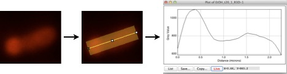

```{r, include=FALSE}
knitr::opts_chunk$set(dev='CairoJPEG', fig.align='center')
#knitr::opts_chunk$set(dev='CairoPNG', fig.align='center')
```
## Introduction
Cell Profiles will take a series of fluorescent profiles acquired in ImageJ/Fiji/etc, arrange them from shortest to longest, then use Hadley Wickam’s ggplot2 to plot the profiles out as a vertical stack ordered by cell length. Each horizontal line represents the fluorescent intensity profile of a single cell. By ordering cells according to length, general localization patterns over the cell cycle of a population can be easily visualized.

## Data acquisition in ImageJ
1. Work on only one image at a time. The ROI manager in ImageJ is not so sophisticated that it will keep track of multiple windows.

2. Select cells in your image and save one at a time as ROIs (press ‘t’ once a cell is selected). Use the live profile view to choose your selections carefully.

3. If working with a stack, remove slice info from the ROIs using the ROI manager (or else reduce your stack to one image), and ensure the correct layer is active.

4. Choose multiplot from the ROI manager, then copy the data points from the list view into a spreadsheet.

5. Save the spreadsheet as a .csv file.

Note: although the labels for the ggplot graphs assume your source images were calibrated at the um scale, they are trivial to change to other scales.

## Cell Profiles package contents
- Example plots are found in this documentation

- Example data file path can be accessed via `system.file("extdata", "ftsZ_profiles.csv", package = "cellProfiles")`

## How to use this script: workflow example
**initial installation**

- First install &/or load several required/suggested packages.
```{r, eval=FALSE}
packages <- c("ggplot2","RColorBrewer","devtools", "Cairo", "scales")
install.packages(packages)
```

- Next install the `cellProfiles` package from GitHub using `devtools`
```{r, eval=FALSE}
library("devtools")
devtools::install_github("ta-cameron/Cell-Profiles")
```

**subsequent usage**

1. Load the package & ggplot2.
```{r, results="hide", message=FALSE}
#strictly speaking, none of these (aside from `cellProfiles`, of course) is required to use `cellProfiles`, however these packages are required for the examples below
packages <- c("ggplot2","RColorBrewer","grid","Cairo","scales","cellProfiles")
sapply(packages, require, character.only=TRUE)
```
This loads `ggplot2`, `RColorBrewer`, `grid`, `Cairo`, `scales`, and the `cellProfiles` functions `cellProfiles()` & `cellProfileTruncate()` for your current R session.

2. Load your data prepared as described above.
```{r}
data_path <- system.file("extdata", "ftsZ_profiles.csv", package = "cellProfiles")
dtable <- read.table(data_path, header=FALSE, sep=",")
```

3. Run `cellProfileTruncate()` if necessary to clip ends of profiles.
```{r, eval=FALSE}
dtable <- cellProfileTruncate(data=dtable, adjust=2)
```

4. Run `cellProfiles()` command with desired options & save output.
```{r, message=FALSE, results="hide"}
profileResults <- cellProfiles(data=dtable, contrast="norm")
```

5. Use `ggplot2` to generate the demograph.
```{r, fig.width=4, fig.height=3}
#CENTERED -norm
# this is a good starting point for structuring your ggplot command
# Note: uses interpolated data set: profileResults$lim_interp_dtable
# For non-interpolated data, use: profileResults$lim_or_dtable 
g <- ggplot(data=profileResults$interpolated, 
            mapping=aes(x=x, y=y, fill=intensity, color=intensity) ) + 
  geom_tile() +
  #geom_raster() + #an alternative rendering mode to geom_tile(). faster but has compatibility limitations
	scale_y_continuous(expand=c(0,0), breaks=seq(0,1,0.25), trans="reverse") + 
	scale_x_continuous(expand=c(0,0)) +
  coord_cartesian(ylim=c(0,1)) +
  theme_classic() +
  theme(axis.line.x = element_line(color="grey40", size = 0.7), 
        axis.line.y = element_line(color="grey40", size = 0.7), 
        plot.title = element_text(hjust = 0.5)) +
  scale_fill_gradientn(colours=rev(brewer.pal(9, "YlGnBu")), guide="colorbar", na.value=NA) + 
  scale_color_gradientn(colours=rev(brewer.pal(9,"YlGnBu")), guide="colorbar", na.value=NA) + 
	labs(x="distance from midcell (um)", y="fraction of cell cycle", title="1- position=\"center\"")

#use the following within RStudio:
#dev.new(width=4, height=3, noRStudioGD=TRUE)
g
```

6. If desired, adjust the options, then execute again.

```{r, fig.width=4, fig.height=3, results="hide"}
#re-calculate with position="left"
profileResults<-cellProfiles(data=dtable, position="left", contrast="norm")

#NOT CENTERED -norm
# this is a good starting point for structuring your ggplot command
# Note: uses actual resolution of data set: profileResults$lim_or_dtable
# For interpolated data, use: profileResults$lim_interp_dtable 
g2 <- ggplot(data=profileResults$interpolated, 
             mapping=aes(x=x, y=y, fill=intensity, color=intensity ) ) + 
  geom_tile() +
  scale_y_continuous(expand=c(0,0), breaks=seq(0,1,0.25), trans="reverse") + 
  scale_x_continuous(expand=c(0,0)) +
  coord_cartesian(ylim=c(0,1)) +
  theme_classic() +
  theme(axis.line.x = element_line(color="grey40", size = 0.7), 
        axis.line.y = element_line(color="grey40", size = 0.7), 
        plot.title = element_text(hjust = 0.5) ) +
  scale_fill_gradientn(colours=rev(brewer.pal(9, "YlGnBu")), guide="colorbar", na.value=NA) + 
  scale_color_gradientn(colours=rev(brewer.pal(9,"YlGnBu")), guide="colorbar", na.value=NA) + 
  labs(x="length of cell (um)", y="fraction of cell cycle", title="2- position=\"left\"")

#use the following within RStudio:
#dev.new(width=4, height=3, noRStudioGD=TRUE)
g2
```

##Saving graphs
The last drawn graph can be saved directly as png, tiff, or pdf files with the following commands:

`ggsave("cell_profiles.png", width=4.86,height=3.4, units="in", dpi=300, type="cairo-png")`
`ggsave("cell_profiles.tiff", width=4.86,height=3.4, units="in", dpi=300, type="cairo")`
`ggsave("cell_profiles.pdf", width=4.86,height=3.4, units="in", dpi=300, device=cairo_pdf)`

I recommend the `Cairo` package as it seems to handle these tile graphs better than some of the other options.

##Raster plots
- ONLY when using interpolated data, geom_raster() can be used instead of geom_tile().
- This will reduce file size & drawing time when dealing with many cells.
- However, some PDF-viewing programs (such as Apple's Preview.app) do not display or handle these files correctly, so I only recommend this for internal use.

##Things may break on occasion
Everything was tested and operational against the latest version of R, ggplot, and other required packages at the time of release. However, subsequent updates could (and have in the past) cause the script to fail to run. Let me know if this happens, as usually the fixes are fairly simple.


# Function details

## cellProfiles()
This function adjusts contrast, aligns, and orders cells for graphing.


| | |
|-------- | ---------------------------------------------------- |
|**usage**    | `cellProfiles(data=NULL, position="center", align="native", reverse=FALSE, contrast="native", range=c(0.02,0.98))` |
|**example**    | `profileResults <- cellProfiles(data=dtable, contrast="norm")` |


| argument | examples        | description                                                      |
|----------|----------------------|---------------------------------------------------------------------------|
| data     | = dtable        | the raw data table. requires wide-format data with alternating paired columns of cell length and intensity values. **(required)**                                                      |
|          |                 |                                                                  |
| position | = **“center”**  | **shifts cells so that mid-cell is centered. (default) **        |
|          | = “left”        | shifts cells so that their origins are aligned.                  |
|          |                 |                                                                  |
| align    | = **“native”**  | **retains original cell orientations. (default)**                |
|          | = “orient”      | flips orientations so brightest halves are all on the right side. this is weighted by a log(1:10) scale for each cell half.                                                     |
|          | = “random”      | randomly chooses half of the profiles and reverses their orientation.  |
|          | = cellProfiles output      | reuses the orientations of the provided cellProfiles output data.          |
|          |                 |                                                                  |
| reverse  | = **FALSE**       | **no change to final orientations. (default)**                   |
|          | = TRUE            | reverses the final orientations.                                 |
|          |                 |                                                                  |
| contrast | = **“native”**  | **no contrast adjustments; native fluorescence values. (default)**     |
|          | = “norm”        | for each cell, divides by its mean fluorescence.                 |
|          | = “max”         | for each cell, rescales the intensities to range from 0 to 1.    |
|          |                 |                                                                  |
| range    | = **c(0.02,0.98)**  | a numeric vector of length 2, ranging from 0 to 1. defines the lower and upper percentiles of the data to include in the color scale range. **(default c(0.02,0.98))**   |
|          | = c(0.05,0.995)                                                                    |


This function exports several different tables for graphing and other purposes. Access them from the variable you saved the results into (`profileResults` in the example above), in the form: `profileResults$variableName`.


| variable | description |
|----------|--------------------------------------------------------------------------------------------------|
| **data** | |
| interpolated | a long-format data table used for making ggplot2 ‘tile’ graphs. the fluorescence intensity values in this table are truncated by the limits set by the range option & interpolated to a resolution of 0.02 um to yield smoother color gradients. |
| native | a long-format data table used for making ggplot2 ‘tile’ graphs. the fluorescence intensity values in this table are truncated by the limits set by the range option. |
| proportional | interpolated data table with cell length converted into fraction of total cell length at a resolution of 2%. |
| wide | the native fluorescence intensity data table, presented in a wide-format. save this to a csv file in your current directory using: `write.csv(as.matrix(profileResults$wide), file="cellprofiles wide format.csv")` |
| fliplist | a vector recording any changes in the orientations of individual cell profiles |


## cellProfileTruncate()
This function removes a set number of rows from the beginning and end of each cell. Use to manually correct for profile acquisition artifacts that can occur at cell poles when using wide profile lines (poles can appear darker than they should, since the rectangular line profile will include a significant proportion of dark background at the cell poles).


| | |
|-------- | ---------------------------------------------------- |
|**usage**    | `cellProfileTruncate(data=NULL, adjust=0)` |
|**example**    | `dtable <- cellProfileTruncate(data=raw_dtable, 1)` |


| argument | examples        | description                                                      |
|----------|----------------------|---------------------------------------------------------------------------|
| data     | = dtable        | the raw data table. requires wide-format data with alternating paired columns of cell length and intensity values. **(required)**                                                |
|          |                 |                                                                  |
| adjust | = 2  | a positive integer representing the number of rows to trim from the top and bottom of each cell profile. (**default=0**) 


As an alternative to slightly truncating the cell poles, the graph can be given a dark background color into which the problem regions will blend.


#Example Graphs
##Position
Centered graphs make it easier to see midcell localization patterns, although the x-axis is somewhat less intuitive. If for some reason you need to have cells on the right, use the ggplot2 option `+scale_x_continuous(trans="reverse")` .

```{r, fig.width=6, fig.height=3, fig.show='hold', results="hide", message=FALSE}
#Modifying the previous plots to save space 
g <- g + theme_classic(base_size = 10) + theme(axis.line.x = element_line(color="grey40", size = 0.7), axis.line.y = element_line(color="grey40", size = 0.7), legend.position="none", plot.title = element_text(hjust = 0.5))

g2 <- g2 + theme_classic(base_size = 10) + theme(axis.line.x = element_line(color="grey40", size = 0.7), axis.line.y = element_line(color="grey40", size = 0.7), legend.position="none", plot.title = element_text(hjust = 0.5))

#the following is simply making use of grid to output this in a bit nicer layout
vplayout <- function(x,y) viewport(layout.pos.row=x,layout.pos.col=y)
grid.newpage()
pushViewport(viewport(layout=grid.layout(1,2)))
print(g,vp=vplayout(1,1))
print(g2,vp=vplayout(1,2))
```

##Contrast
Ideally, native contrast could always be used. However, variations in fluorescence intensity between cells can make visualization difficult, and particularly intense fluorescence can throw off the color scale (although this is mitigated somewhat by the default `range=c(0.02,0.98)` ). Note the bright streaks in graph 3.

A simple alternative to native contrast is to simply stretch the range of fluorescence values in each cell to fit between 0 and 1. This maximizes contrast for each cell, but can  over-emphasize cells with low contrast (eg, cells with diffuse fluorescence). In graph 4, `range=c(0,1)` was used because further clipping of the color scale is unnecessary.


```{r, fig.width=6, fig.height=3, fig.show='hold', results="hide"}
profileResults <- cellProfiles(data=dtable)
pt3 <- g %+% profileResults$interpolated + labs(title="3- contrast=\"native\"\n")

profileResults<-cellProfiles(data=dtable,contrast="max",range=c(0,1))
pt4 <- g %+% profileResults$interpolated + labs(title="4- contrast=\"max\",\n range=c(0,1)")

grid.newpage()
pushViewport(viewport(layout=grid.layout(1,2)))
print(pt3,vp=vplayout(1,1))
print(pt4,vp=vplayout(1,2))
```

One way to resolve differences in fluorescence is by dividing each value in the cell by the cell’s average fluorescence. This emphasizes differences in profile fluorescence, and makes it easier to see the fluorescence patterns in all cells. 

Graphs 5-8 demonstrate how different range settings can have significant impacts on the contrast of the final graph. The range often needs to be fine-tuned for each data set, depending on the distribution of high & low fluorescence values.

```{r, fig.width=6, fig.height=6, fig.show='hold', results="hide"}
profileResults<-cellProfiles(data=dtable,contrast="norm",range=c(0,1))
pt5 <- g %+% profileResults$interpolated + labs(title="5- contrast=\"norm\",\n range=c(0,1)")

profileResults<-cellProfiles(data=dtable,contrast="norm",range=c(0.005,0.995))
pt6 <- g %+% profileResults$interpolated + labs(title="6- contrast=\"norm\",\n range=c(0.005,0.995)")

profileResults<-cellProfiles(data=dtable,contrast="norm",range=c(0.02,0.98))
pt7 <- g %+% profileResults$interpolated + labs(title="7- contrast=\"norm\",\n range=c(0.02,0.98)")

profileResults<-cellProfiles(data=dtable,contrast="norm",range=c(0.05,0.95))
pt8 <- g %+% profileResults$interpolated + labs(title="8- contrast=\"norm\",\n range=c(0.05,0.95)")

grid.newpage()
pushViewport(viewport(layout=grid.layout(2,2)))
print(pt5,vp=vplayout(1,1))
print(pt6,vp=vplayout(1,2))
print(pt7,vp=vplayout(2,1))
print(pt8,vp=vplayout(2,2))
```

##Alignment
There are several options for adjusting the orientations of individual cell profiles. Aside from the native orientation (graph 9), cells can be randomly flipped (graph 11), or aligned so that the brightest sides of all cells are together (based on pole-weighted intensity, graph 10).

The orientations of all cells can be flipped by setting reverse=TRUE (compare graph 10 to graph 12). The last calculated orientations can also be reused (graphs 13 & 14) by providing the results of a prior `cellProfiles()` run as the value of "align". This could be useful in cases where you have collected profiles for a polarity marker and a second protein of interest for the same set of cells: first orient the cells using the polarity marker, then reuse these orientations for a second calculation with the profiles of the protein of interest.

```{r, fig.width=6, fig.height=9, fig.show='hold', results="hide"}
profileResults <- cellProfiles(data=dtable,contrast="max")
pt9 <-g %+% profileResults$interpolated + labs(title="9- align=\"native\",\n contrast=\"max\"")

profileResults <- cellProfiles(data=dtable,align="orient",contrast="max")
pt10 <-g %+% profileResults$interpolated + labs(title="10- align=\"orient\",\n contrast=\"max\"")

profileResults <- cellProfiles(data=dtable,align="random",contrast="max")
pt11 <- g %+% profileResults$interpolated + labs(title="11- align=\"random\",\n contrast=\"max\"")

profileResults <- cellProfiles(data=dtable,align="orient",contrast="max",reverse=TRUE)
pt12 <- g %+% profileResults$interpolated + labs(title="12- align=\"orient\", reverse=TRUE, \ncontrast=\"max\"")

profileResults <- cellProfiles(data=dtable,align=profileResults,contrast="max",reverse=TRUE)
pt13 <- g %+% profileResults$interpolated + labs(title="13- align=profileResults, \nreverse=TRUE, contrast=\"max\"")

profileResults <- cellProfiles(data=dtable,align=profileResults,contrast="max",reverse=TRUE)
pt14 <-g %+% profileResults$interpolated + labs(title="14- align=profileResults, \nreverse=TRUE, contrast=\"max\"")

grid.newpage()
pushViewport(viewport(layout=grid.layout(3,2)))
print(pt9,vp=vplayout(1,1))
print(pt10,vp=vplayout(1,2))
print(pt11,vp=vplayout(2,1))
print(pt12,vp=vplayout(2,2))
print(pt13,vp=vplayout(3,1))
print(pt14,vp=vplayout(3,2))
```

##Additional ways to plot data
Depending on how creative you're feeling, there are a variety of other ways to use this length/intensity data. For instance, you can split the cell length population into distinct quantiles, then plot each quantile as pseudo-violin plots, where width indicates average intensity per relative cell length within that quantile (graph 15). Okay, maybe that is getting a little *too* creative.

Graphs 15 & 16 show the relatively vanilla approach of plotting individual cell profiles as lines on regular x-y graphs. Graph 15 varies the color of each line according to the ordered length of each cell. Graph 16 splits the cells into three quantiles (short, medium, long) and graphs these in distinct colors.

Graph 18 simply plots the gaussian kernel density estimate of the cell length of all the cells measured. This may give you pause at first, but consider what percentage of the observed cells are likely to be in each stage of cell division unde your growth conditions.

```{r, fig.width=7, fig.height=6, fig.show='hold', results="hide"}
#================================================================
#15- violin plots of length quantiles \n
# wherein I badly abuse geom_violin for something it was never intended
#================================================================

#contrast="max" yields the greatest variability, but native or norm may be more representative of the average
profileResults <- cellProfiles(data=dtable, contrast="max")

#first determine cell lengths --> cell
profileResults$interpolated$cell <- NA
profileResults$proportional$cell <- NA
for (i in unique(profileResults$interpolated$y)){
  cell <- max(profileResults$native[profileResults$native$y == i & !is.na(profileResults$native$intensity), "x"], na.rm=TRUE) -
    min(profileResults$native[profileResults$native$y == i & !is.na(profileResults$native$intensity), "x"], na.rm=TRUE)
  profileResults$interpolated[profileResults$interpolated$y == i, "cell"] <- cell
  profileResults$proportional[profileResults$proportional$y == i, "cell"] <- cell
}
rm(cell)

#next categorize into five discrete quantiles --> cell_cat
cutoffs <- quantile(profileResults$interpolated$cell, probs=c(0,0.2,0.4,0.6,0.8), na.rm=TRUE )
profileResults$interpolated$cell_cat <- NA
profileResults$proportional$cell_cat <- NA
for(i in unique(profileResults$interpolated$cell)){
  cell_cat <- cutoffs[[ which( cutoffs==max(cutoffs[(cutoffs <= i )]) ) ]]
  profileResults$interpolated[profileResults$interpolated$cell == i, "cell_cat"] <- cell_cat
  profileResults$proportional[profileResults$proportional$cell == i, "cell_cat"] <- cell_cat
}
rm(cell_cat)

pt15 <- ggplot(data=profileResults$proportional, mapping=aes(x=factor(cell_cat), y=x*cell_cat, weight=(intensity)^2 ) ) +
    #also look into using scale="count" or "area"
		geom_violin(adjust=0.5, bw="sj", scale="width") +
  	theme_classic(base_size=10) +
    theme(axis.line.x = element_line(color="grey40", size = 0.7), axis.line.y = element_line(color="grey40", size = 0.7), plot.title = element_text(hjust = 0.5)) +
		labs(x="cell length quantile\n(widths indicate relative min/max intensity)",y="cell length (um)",title="15- cell length quantile profiles")

#================================================================
#16- line plots with rank-colored lines
#================================================================
profileResults <- cellProfiles(data=dtable,contrast="norm",align="orient")

pt16 <- ggplot(data=profileResults$proportional, mapping=aes(x=x, y=intensity, group=factor(y), color=y) ) +
  geom_line(stat="identity", position="identity", alpha=0.3) +
  coord_cartesian(xlim=c(0,1)) +
  theme_classic(base_size=10) +
  theme(axis.line.x = element_line(color="grey40", size = 0.7), axis.line.y = element_line(color="grey40", size = 0.7), plot.title = element_text(hjust = 0.5), legend.position="none") +
  scale_color_gradient2(low="blue", mid="purple", high="red", midpoint=0.5) +
  labs(x="fraction of cell length", y="normalized intensity", title="16- line plots colored by\nordered length of cells")

#================================================================
#17- line plots split between short\nmedium & long cells (simple mean & confidence)
#================================================================

#the next lines add a third colum that defines how to split the cells into categories
profileResults$proportional$split <- round(profileResults$proportional$y*2)

pt17 <- ggplot(data=profileResults$proportional, mapping=aes(x=x, y=intensity, group=factor(split), color=factor(split), fill=factor(split))) +
		geom_line(mapping=aes(group=factor(y)), stat="identity", position="identity", alpha=0.5) +
    stat_summary(fun.data="mean_cl_boot", geom="smooth", alpha=0.5, color=NA, fill="black") +
		stat_summary(fun.y="mean", geom="line", size=1.25) +
		coord_cartesian(xlim=c(0,1)) +
		scale_color_brewer(palette="Set1") +
		scale_fill_brewer(palette="Set1") +
    theme_classic(base_size=10) +
    theme(axis.line.x = element_line(color="grey40", size = 0.7), axis.line.y = element_line(color="grey40", size = 0.7), plot.title = element_text(hjust = 0.5), legend.position="none") +
		labs(x="fraction of cell length", y="normalized intensity", title="17- line plots split between short, medium,\n& long cells (simple mean & confidence)")

#note: mean_cl_boot (based on smean.cl.boot from the Hmisc package) is "a very fast implementation of the basic nonparametric bootstrap for obtaining confidence limits for the population mean without assuming normality"

#================================================================
#18- gaussian kernel density \nplot of cell lengths
#================================================================

profileResults <- cellProfiles(data=dtable, position = "left")
lengths <- rep(NA, length(profileResults$fliplist))
n <- 1
for (i in unique(profileResults$native$y)){
  lengths[n] <- max(profileResults$native[profileResults$native$y == i & !is.na(profileResults$native$intensity), "x"], na.rm=TRUE)
  n <- n+1
}
lengths <- as.data.frame(lengths)

pt18 <- ggplot(data=lengths, mapping=aes(x=lengths)) +
		layer(geom="density", stat="density", position="identity") +
    theme_classic(base_size=10) +
    theme(axis.line.x = element_line(color="grey40", size = 0.7), axis.line.y = element_line(color="grey40", size = 0.7), plot.title = element_text(hjust = 0.5), legend.position="none") +
    scale_x_continuous(expand=c(0,0)) +
		scale_y_continuous(expand=c(0,0), limits=c(0,1)) +
		labs(x="cell length (um)", y="probability density", title="18- gaussian kernel density \nplot of cell lengths")

grid.newpage()
pushViewport(viewport(layout=grid.layout(2,2)))
print(pt15,vp=vplayout(1,1))
cat(" ---> Yes, those errors are to be expected... this isn't what violin plots were intended for. <---")
print(pt16,vp=vplayout(1,2))
cat(" ---> This one takes a moment to draw... be patient. <---")
print(pt17,vp=vplayout(2,1))
print(pt18,vp=vplayout(2,2))
```

##Cell profile colocalization
If you have colocalization data, you can also visualize this by combining the results of two cell profiles calculations. For this to work properly, the data must be exactly the same, except for the differences in intensity values. MicrobeTracker occasionally produces errors where one color for a few cells is shorter by one data point, so if you run into errors, examine your data carefully.


```{r, fig.width=6, fig.height=3, fig.show='hold', results="hide"}
#================================================================
#19 & 20 - two-color colocalization
#================================================================

# first load two data sets [NOT SHOWN]
# next run the cell profiles function for each of them
# here I am simply reusing the same data set, but oriented to the left or right
# obviously you will not want to *exactly* copy this to compare two *different* data sets

# the range / contrast of each channel will need to be carefully adjusted
profileResults1 <- cellProfiles(data=dtable,contrast="norm", align="orient", range=c(0.06,0.98))
profileResults2 <- cellProfiles(data=dtable,contrast="norm",align="orient", reverse=TRUE, range=c(0.06,0.98))

#rescale intensities to 0-1
profileResults1$interpolated$r <- rescale(profileResults1$interpolated$intensity)
profileResults1$interpolated$g <- rescale(profileResults2$interpolated$intensity)

#troubleshooting
# if your two data sets do not have exactly the same number of points, you will get issues and errors!
# MicrobeTracker occassionally produces such errors, so double check your data carefully if you use it.
# it may help to look at the final data sets, which can be exported in wide-format with the code below
# write.csv(as.matrix(profileResults1$interpolated$r), file="profile table 1 (red).csv")
# write.csv(as.matrix(profileResults2$interpolated$g), file="profile table 2 (green).csv")

#straight red/green probably works best, as straight blue too closely matches the black background

#convert values to rgb
profileResults1$interpolated$rgb[!is.na(profileResults1$interpolated$r)] <- rgb(
  na.omit(profileResults1$interpolated$r),
  na.omit(profileResults1$interpolated$g),
  0 )

pt19 <- g %+% profileResults1$interpolated + aes(fill=rgb, color=rgb) +
  scale_fill_identity() + scale_color_identity() +
  labs(x="distance from midcell (um)", y="fraction of cell cycle", title="19- red/green colocalization")

#alternate light blue / orange colors for a more color-blind friendly palette
# in case you don't want to be evil

#convert values to rgb
profileResults1$interpolated$rgb[!is.na(profileResults1$interpolated$r)] <- rgb(
  na.omit(profileResults1$interpolated$r),
  0.5*na.omit(profileResults1$interpolated$g)+0.5*na.omit(profileResults1$interpolated$r),
  na.omit(profileResults1$interpolated$g) )

pt20 <- g %+% profileResults1$interpolated + aes(fill=rgb, color=rgb) +
  scale_fill_identity() + scale_color_identity() +
  labs(x="distance from midcell (um)", y="fraction of cell cycle", title="20- blue/orange colocalization")

grid.newpage()
pushViewport(viewport(layout=grid.layout(1,2)))
print(pt19,vp=vplayout(1,1))
print(pt20,vp=vplayout(1,2))
```